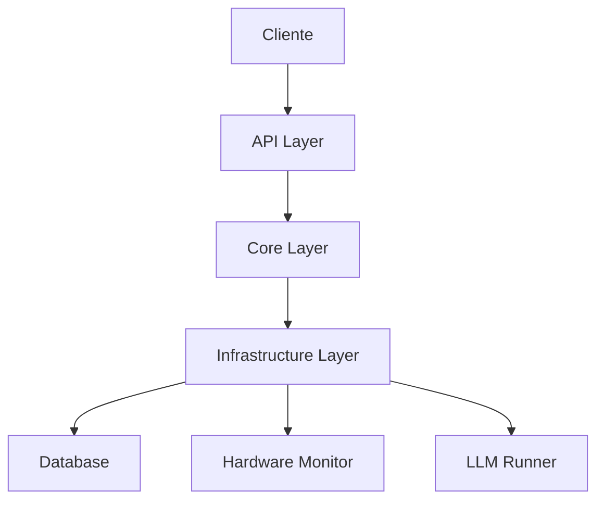
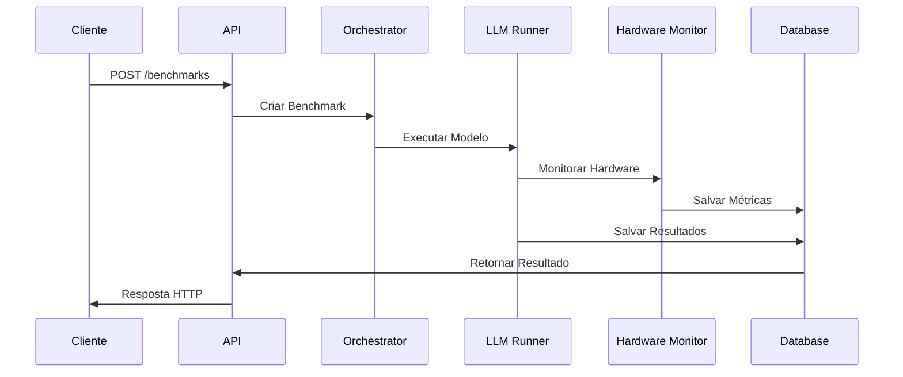

# Arquitetura do LLM Bench Local

## Visão Geral da Arquitetura

O LLM Bench Local é construído como um microserviço modular, seguindo princípios de Clean Architecture e Domain-Driven Design. A aplicação é dividida em camadas bem definidas, cada uma com responsabilidades específicas.

Para um benchmark de LLM completo, a solução pode ser organizada em três projetos interligados:

1. **Core** – Biblioteca com toda a lógica de machine learning, execução de modelos e pipelines RAG.
2. **Backend** – API e orquestração dos benchmarks, expondo serviços REST.
3. **Frontend** – Interface web para configuração de testes e visualização de resultados.

Esta estrutura facilita a evolução independente de cada parte e permite integrações com novas ferramentas no futuro.

## Camadas da Aplicação

### 1. API Layer (Interface)

A camada de API é responsável por:
- Expor endpoints REST para interação com o serviço
- Validar e transformar dados de entrada/saída
- Gerenciar autenticação e autorização (se necessário)
- Documentar a API (via Swagger/OpenAPI)

**Tecnologias:**
- FastAPI
- Pydantic para validação de dados
- OpenAPI/Swagger para documentação

### 2. Core Layer (Domínio)

A camada core contém a lógica de negócio principal:
- Definição de entidades e modelos de domínio
- Regras de negócio para execução de benchmarks
- Orquestração de tarefas
- Validações de domínio

**Componentes Principais:**
- `Benchmark`: Entidade principal que representa um benchmark
- `Model`: Representa um modelo de linguagem
- `Task`: Define diferentes tipos de tarefas de benchmark
- `Orchestrator`: Coordena a execução de benchmarks

### 3. Infrastructure Layer

A camada de infraestrutura lida com:
- Persistência de dados
- Monitoramento de hardware
- Execução de modelos LLM
- Logging e telemetria

**Componentes:**
- `Database`: Gerenciamento de persistência (SQLite)
- `HardwareMonitor`: Coleta métricas de hardware
- `LLMRunner`: Executa modelos de linguagem
    - `Logger`: Sistema de logging

### 4. Dataset Layer

A nova camada de dataset centraliza a gestão de conjuntos de dados usados nos benchmarks e pipelines RAG.
Ela permite registrar datasets do Hugging Face Hub ou arquivos locais e carregá-los conforme necessário.

**Componentes:**
    - `DatasetManager`: Registra, lista e carrega datasets

## Fluxo de Dados

1. **Requisição de Benchmark:**
   ```
   Cliente -> API -> Validação -> Orchestrator -> LLMRunner -> HardwareMonitor -> Database
   ```

2. **Consulta de Resultados:**
   ```
   Cliente -> API -> Database -> Transformação -> Resposta
   ```

## Decisões de Arquitetura

### 1. Modularidade

- Cada componente é independente e pode ser testado isoladamente
- Interfaces bem definidas entre camadas
- Fácil substituição de implementações (ex: trocar banco de dados)

### 2. Escalabilidade

- Design stateless para permitir múltiplas instâncias
- Cache de modelos para melhor performance
- Processamento assíncrono de benchmarks longos

### 3. Manutenibilidade

- Código organizado por domínio
- Documentação clara
- Testes automatizados em cada camada

## Diagramas

### Diagrama de Componentes



### Diagrama de Sequência (Benchmark)



## Considerações de Segurança

1. **Validação de Entrada**
   - Todos os dados de entrada são validados via Pydantic
   - Sanitização de prompts e configurações

2. **Isolamento**
   - Execução de modelos em ambiente controlado
   - Limites de recursos (CPU, memória, GPU)

3. **Persistência**
   - Dados sensíveis não são armazenados
   - Backup automático de resultados

## Próximos Passos

1. **Melhorias de Performance**
   - Implementar cache de modelos
   - Otimizar consultas ao banco de dados

2. **Novas Funcionalidades**
   - Suporte a mais backends de LLM
   - Métricas avançadas de hardware
   - Visualização de resultados

3. **Infraestrutura**
   - CI/CD pipeline
   - Monitoramento e alertas
   - Backup automatizado 
